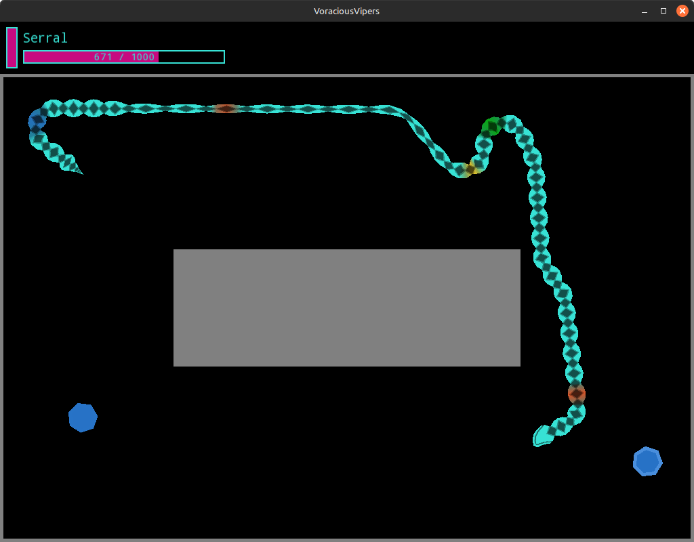
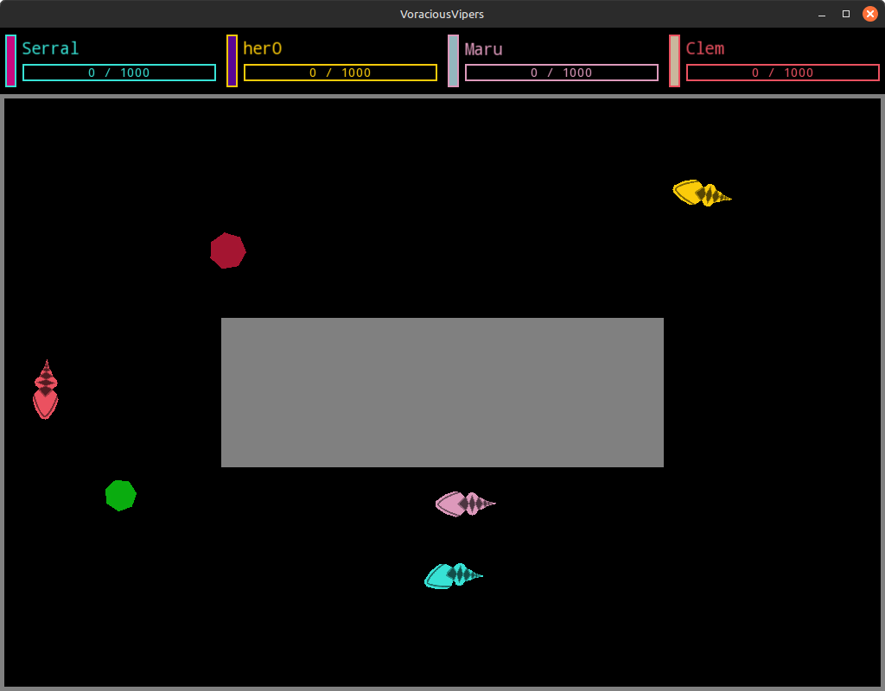
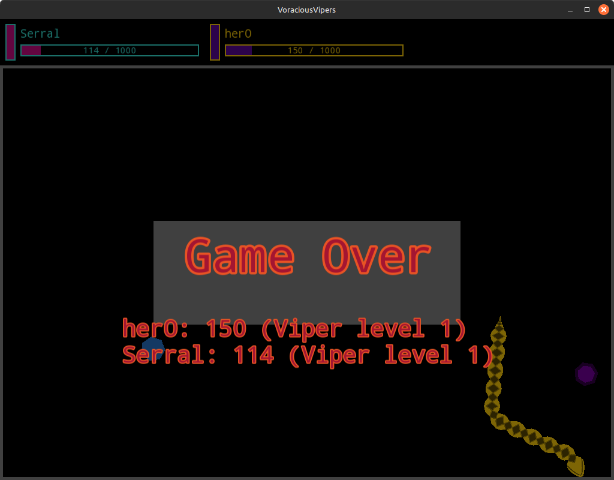

# About
A snake game where you can only steer left, right and/or boost your speed. Currently only one level is implemented, but the game supports up to four local players. Only library dependencies, except for stdlib, are SFML and JsonCpp.

# Screenshots

